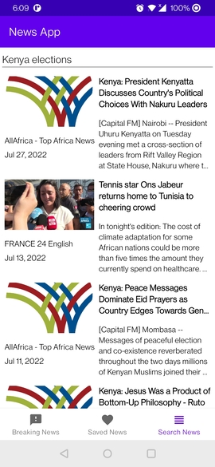

# About The Project
An Android app that fetches news from the RESTful [NewsApi](https://newsapi.org/) and has the following features:
* Displays the top headlines on the main page
* A user can click on an article to read it on the details page
* Articles can be saved and show up on the favourites page
* A user can search for news about different topics

## Description
The app is fully built with Kotlin. It follows the Android MVVM Architecture and Jetpack recommended architecture. The Retrofit library is used to interact with and send network requests to the NewsApi. The Glide library is used to load images. The Room library is used to save articles in a local database. Other Jetpack libraries that have been used include the Navigation, ViewModel, ViewBinding, Webkit and LiveData.

## Pre-requisites
1. Java Development Kit
2. Kotlin
3. Git version control for cloning the repo from Github.
4. Android Studio

## Getting Started
1. Install Android Studio and Kotlin, if you don't already have them.
2. Download or clone the repo.
3. Import the app into Android Studio.
4. Build and run the app.

## Screenshots
&nbsp;
&nbsp;
&nbsp;

## License
Distributed under the MIT License. See [LICENSE](LICENSE) for more information.

## Acknowledgements
This project was created following the tutorial by [Philipp Lackner](https://www.youtube.com/playlist?list=PLQkwcJG4YTCRF8XiCRESq1IFFW8COlxYJ) on YouTube, with a few adjustments to his code. The code is available on Github at [philipplackner/MVVMNewsApp](https://github.com/philipplackner/MVVMNewsApp/tree/master).